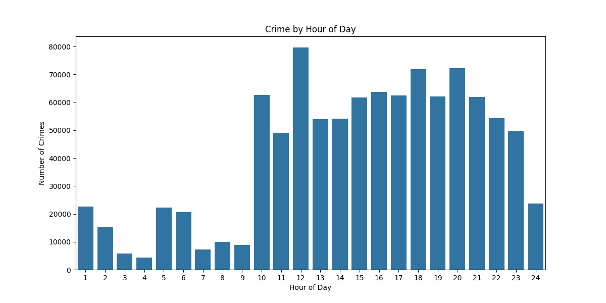

# Los Angeles Crime Data Analysis

---

## 📌 Project Overview
This project analyzes crime trends in Los Angeles using publicly available crime data. The primary objective is to demonstrate expertise in **data engineering, analytics, visualization, and model training**. The analysis provides insights into crime distribution across time and location, helping identify high-risk areas and trends.

### **Key Features:**
- **Data Collection & Preprocessing**: Extract, clean, and transform raw crime data.
- **Database Integration**: Store and query processed data efficiently.
- **Exploratory Data Analysis (EDA)**: Identify patterns, trends, and correlations.
- **Machine Learning Model**: Attempting Machine Learning for the first time. Used Logistic Regression model.
- **Visualization & Reporting**: Generate interactive dashboards using **Tableau**.

This project is part of my **data portfolio**, aimed at demonstrating end-to-end data analysis and  modeling workflows.

---

## 🛠 Tech Stack
| **Category**         | **Tools & Technologies**          |
|----------------------|---------------------------------|
| **Data Collection**  | Python (Requests, Pandas, Polars)       |
| **Data Storage**    | Google BigQuery (Free Tier)    |
| **Data Processing** | Pandas, Polars, NumPy          |
| **ML & Analytics**  | Scikit-learn          |
| **Visualization**   | Tableau, Folium                         |
| **Workflow**        | Jupyter Notebook, Python Scripts |

---

## 📂 Project Structure
```
la-crime-analysis/
├── code_texts/                                    # Folder for project documentation
│   ├── Los_Angeles_Crime_Prediction_ML_Logic_Explanation.docx
│   └── Machine_Learning_Project_Documentation.docx
│   ├── data_schema/                               # Data schema definitions
│   ├── processed_data/                            # Cleaned and processed data
│   │   └── pre_cleaned_crime_data.parquet
│   └── raw_data/                                  # Raw data
│       └── la_crime_data.csv
├── log/                                           # Folder for log files
│   ├── data_cleaning.log
│   ├── la_crime_type_model_training_evaluation.log
│   └── model_training_crime_analysis.log
│   └── old/                                       # Old log files
│       ├── model_training_output1.txt
│       ├── model_training_output2.txt
│       └── model_training_output2_garbage_collection.txt
├── notebooks/                                     # Jupyter notebooks
│   ├── eda.ipynb
│   ├── eda_geospatial.ipynb
│   └── LA_Crime_Analysis_Model_Google_Colab.ipynb
├── output/                                        # Folder for output files
│   ├── sql_bigquery_output.xlsx
│   ├── deployment_model/                          # Model deployment files
│   │   ├── evaluation_metrics.json
│   │   ├── la_crime_type_model.pkl
│   │   ├── model.pkl
│   │   └── model_evaluation_metrics.json
│   └── model_training_output_files/               # Model training output
│       ├── classification_metrics.csv
│       ├── confusion_matrix.csv
│       └── reshaped_confusion_matrix.csv
├── screenshots/                                   # Folder for screenshots
│   ├── data_download.png
│   └── data_upload_to_bigquery.png
├── sql_queries/                                   # SQL query files
│   ├── additional_cleanup_queries.txt
│   ├── EDA_Queries_for_Crime_Data.txt
│   ├── la_crime_analysis_verifying_queries_after_data_upload.sql
│   ├── queries-for-data-cleaning.sql
│   ├── select_queries_for_data_check.sql
│   └── table_alter_update_queries.sql
├── src/                                           # Folder for source code
│   ├── data_preprocessing_before_bigquery.py
│   ├── download_data.py
│   ├── la_crime_model_results_visualization.py
│   ├── la_crime_type_model_training_evaluation.py
│   └── upload_to_bigquery.py
│   └── src_extras/                                # Extra source code files for texting and explanations - not needed
│       ├── code_examples.py
│       ├── confusion_matrix_conversion.py
│       ├── data_preprocessing_before_bigquery_optimized_knn.py
│       ├── la_crime_type_model_training.py
│       ├── ml_model_training.py
│       ├── ml_model_training_limit_1.py
│       ├── ml_model_training_limit_2.py
│       ├── ml_model_training_limit_3.py
│       ├── test_bigquery_connection.py
│       ├── upload_to_bigquery_debug_comments.py
│       └── verify_cleaned_data.py
├── visualizations/                                 # Folder for visualizations
│   ├── Crime Prediction Metrics (Precision, Recall, F1).twb
│   └── exploratory_data_analysis_viz/              # EDA visualizations
│       ├── crime_by_day_of_week_barplot.png
│       ├── crime_by_hour_of_day_barplot.png
│       ├── crime_distribution_by_type_barplot.png
│       ├── crime_distribution_by_type_countplot.png
│       ├── crime_distribution_by_type_vertical_20_barplot.png
│       ├── crime_distribution_by_type_Vertical_barplot.png
│       ├── crime_heatmap.html
│       └── monthly_crime_trends.png

```

---

## 📊 Data Workflow
1. **Data Collection**: Crime data is sourced from the [LA Open Data Portal](https://catalog.data.gov/dataset/crime-data-from-2020-to-present).
2. **Data Preprocessing**: The dataset undergoes cleaning and transformation using Pandas and Polars.
3. **Database Integration**: Processed data is stored in **Google BigQuery** for analysis.
4. **Exploratory Data Analysis**: Identify trends, seasonal patterns, and crime hotspots. Eg: 
5. **Machine Learning Model**: A **Logistic Regression model** is trained to analyze crime types.
6. **Visualization & Reporting**: Insights on model efficiency are presented via **Tableau dashboards**.

---

### Prerequisites
- **Python**: Install Python 3.x.
- **Google Cloud BigQuery**:  Create an account in oogle Cloud BigQuery (Free Tier).
- **Libraries**: Install the required Python libraries:

## Steps
1. Clone this repository.
2. Make sure necessary libraries are installed. [`pip install -r requirements.txt`]
3. Fetch Crime Data [`download_data.py`](src/download_data.py)
4. Clean and Transform Data [`data_preprocessing_before_bigquery.py`](src/data_preprocessing_before_bigquery.py).
5. Store Processed Data in BigQuery  [`upload_to_bigquery.py`](src/upload_to_bigquery.py)
6. Exploratory Data Analysis [`eda.ipynb`](notebooks/eda.ipynb), [`eda_geospatial.ipynb`](notebooks/eda_geospatial.ipynb).
7. Train Machine Learning Model and Evaluate Model Performance [`la_crime_type_model_training_evaluation.py`](src/la_crime_type_model_training_evaluation.py)
8. Connect the data to Tableau for visualization [`la_crime_model_results_visualization.py`](src/la_crime_model_results_visualization.py)

## 📊 Tableau Dashboard

- 🖥 [`Crime Classification Confusion Matrix`](https://public.tableau.com/app/profile/anitta.antony/viz/CrimeClassificationConfusionMatrix/Model-ConfusionMatrix)
- 🖥 [`Crime Prediction Metrics (Precision, Recall, F1)`](https://public.tableau.com/app/profile/anitta.antony/viz/CrimePredictionMetricsPrecisionRecallF1/CrimeTypePrediction-ModelEvaluation)

---

## 🔗 Additional Resources
- **Dataset Source**: [LA Open Data](https://catalog.data.gov/dataset/crime-data-from-2020-to-present)
- **Google BigQuery Free Tier Guide**: [Google BigQuery](https://cloud.google.com/bigquery/pricing)
- **Tableau Public**: [Tableau Public](https://public.tableau.com/)

---

## 📌 Why This Project Matters
✅ **Demonstrates expertise in data processing & analytics**  
✅ **Showcases hands-on experience with BigQuery, Polars, Pandas, and ML**  
✅ **Presents insights using Tableau dashboards**  
 
