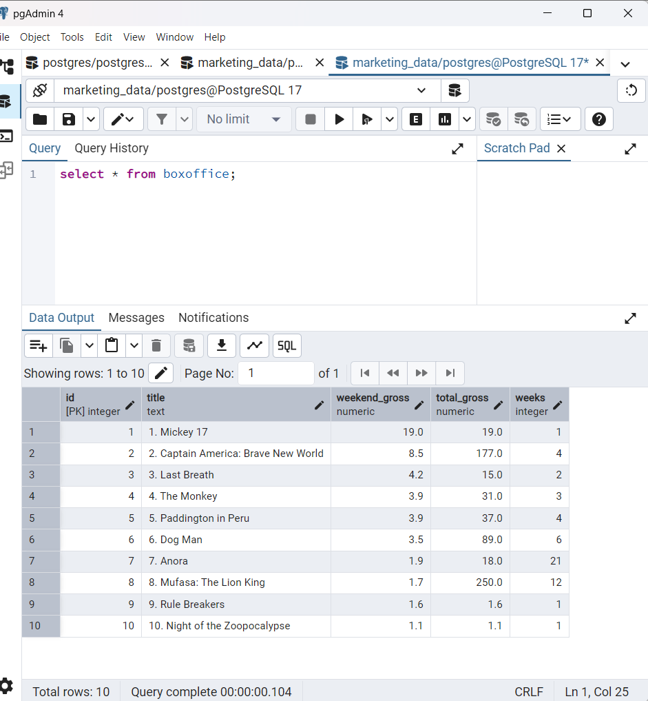
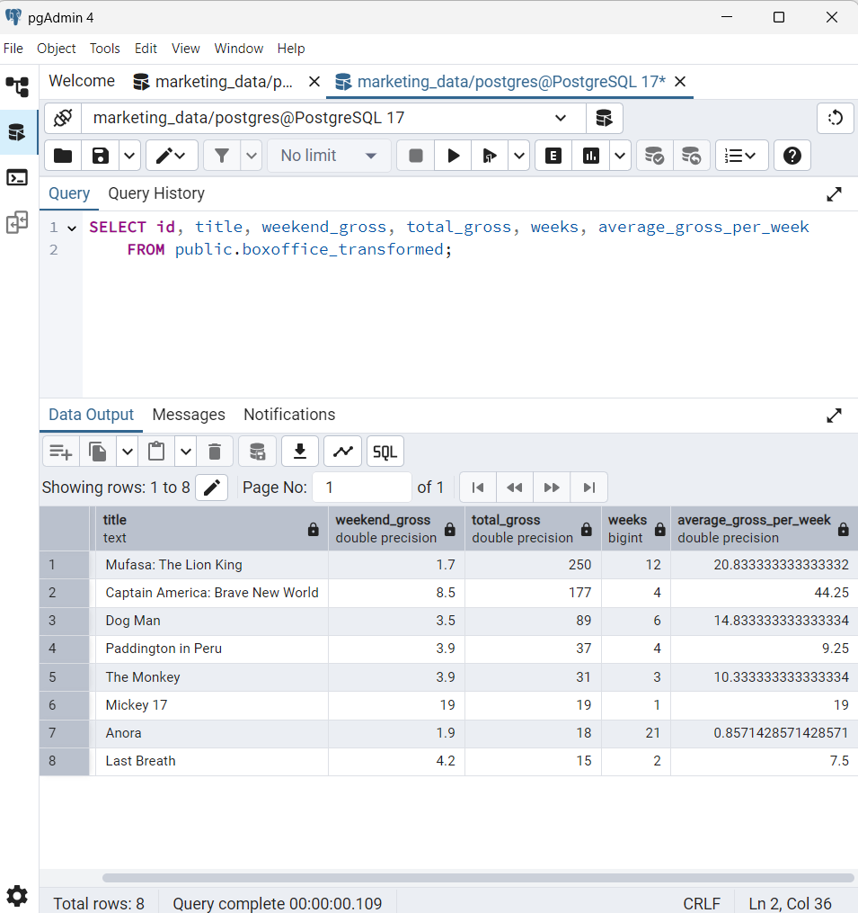

# Box-Office Data Pipeline & Dashboard

## Project Overview
The goal of this project is to build a **data pipeline** that collects, processes, and visualizes marketing data (e.g., box office performance) to generate actionable insights. The pipeline includes the following steps:

1. **Data Collection**: Web scraping to collect box office data from IMDb.
2. **Data Storage**: Storing the scraped data in a PostgreSQL database.
3. **Data Processing & Transformation**: Cleaning and transforming the data for analysis.
4. **Data Visualization**: Creating visualizations to analyze the data.

---


### 1. **Data Collection (Web Scraping)**
- **Objective**: Collect box office data from IMDb [`Link`](https://www.imdb.com/chart/boxoffice/).
- **Tools Used**: Python, Selenium, BeautifulSoup.
- **Script**: [`scrape_imdb_boxoffice.py`](scripts/scrape_imdb_boxoffice.py)
- **Output**: A CSV file (`boxoffice_data.csv`) containing the scraped data.

#### Sample Data
| Title                                | Weekend Gross | Total Gross | Weeks |
|--------------------------------------|---------------|-------------|-------|
| 1. Mickey 17                         | $19M          | $19M        | 1     |
| 2. Captain America: Brave New World  | $8.5M         | $177M       | 4     |
| 3. Last Breath                       | $4.2M         | $15M        | 2     |
| 4. The Monkey                        | $3.9M         | $31M        | 3     |
| 5. Paddington in Peru                | $3.9M         | $37M        | 4     |

---

### 2. **Data Storage (PostgreSQL)**
- **Objective**: Store the scraped data in a PostgreSQL database.
- **Tools Used**: PostgreSQL, Python (`psycopg2`).
- **Scripts**: [`database_and_table_creation.sql`](scripts/database_and_table_creation.sql), [`load_csv_to_db.py`](scripts/load_csv_to_db.py)
- **Database**: `marketing_data`
- **Table**: `boxoffice`

### Run the Script
The script [`load_csv_to_db.py`](scripts/load_csv_to_db.py) reads the CSV file, cleans the data, and inserts it into the `boxoffice` table.

- **Table data**: `boxoffice`  
  

### 3. **Data Processing & Transformation**
- **Objective**: Clean and transform the data for analysis.
- **Tools Used**: Python (pandas), SQL
- **Script**: [`data_processing_panda_postgresql.py`](scripts/data_processing_panda_postgresql.py)
- **Output**: A new table, `boxoffice_transformed`, which contains processed and transformed data.
- **Tasks**:
  - Remove unnecessary columns.
  - Handle missing or invalid data.
  - Convert data types (e.g., strings to numeric).
### Run the Script
The script [`data_processing_panda_postgresql.py`](scripts/data_processing_panda_postgresql.py) process and transform data into the `boxoffice_transformed` table.

- **Table data**: `boxoffice_transformed`  
  


### 4. **Data Analysis & Visualization** 
- **Objective**: Create visualizations to analyze the data.
- **Tools Used**: PostGreSQL, Tableau Desktop.
- **Script**: [`data_analysis.sql`](scripts/data_analysis.sql)
- **Tasks**:
	- Create CSV files using SQL queries for tableau data source
	- Create charts (e.g., bar charts, line charts) to visualize box office performance.
	- Analyze trends (e.g., top-performing movies, revenue over time).
 - **Output**: Tableau Public dashboard is created - [`Box Office Performance Analysis`](https://public.tableau.com/app/profile/anitta.antony/viz/BoxOfficePerformanceAnalysis/BoxOfficePerformanceAnalysis?publish=yes)
---
## Folder Structure ##
```
marketing-data-pipeline/
├── data/                    				# Folder for raw and processed data (e.g., CSV files)
│   ├── raw/                 				# Raw scraped data
│   │   └── boxoffice_data.csv
├── screenshots/                 				# Screenshots of scripts running in local machine
├── scripts/                 				# Folder for all Python scripts
│   ├── web_scraping/        				# Web scraping scripts (BeautifulSoup, Selenium)
│   │   └── scrape_imdb_boxoffice.py       			# Script for web scraping
│   ├── data_loading/        				# Loading data into PostgreSQL
│   │   └── load_csv_to_db.py     			# Script to load data into PostgreSQL
│   ├── data_processing/     				# Data cleaning and transformation scripts (Pandas, SQL)
│   │   └── data_processing_panda_postgresql.py  	# Data transformation script
│   ├── data_visualization/     			# Data analysis and visualization scripts (SQL)
│   │   └── data_analysis.sql     			# Scripts/Queries for data analysis which later used in Tableau
├── dashboards/               				# Visualization components
├── README.md                				# Project overview and instructions
├── requirements.txt         				# List of Python dependencies
└── .gitignore               				# Ignore unnecessary files (e.g., .env, __pycache__)
```
## How to Run the Project

### Prerequisites
- **Python**: Install Python 3.x.
- **PostgreSQL**: Install PostgreSQL and create a database (`marketing_data`).
- **Libraries**: Install the required Python libraries:
  ```bash
  pip install psycopg2 selenium beautifulsoup4 pandas sqlalchemy
  ```
## Steps
1. Clone this repository.
2. Install dependencies: `pip install -r requirements.txt`.
3. Set up PostgreSQL and run [`database_and_table_creation.sql`](scripts/database_and_table_creation.sql)` to create the database schema.
4. Run the web scraping script [`scrape_imdb_boxoffice.py`](scripts/scrape_imdb_boxoffice.py).
5. Load the data using  [`load_csv_to_db.py`](scripts/load_csv_to_db.py)
6. Process the data using scripts in [`data_processing_panda_postgresql.py`](scripts/data_processing_panda_postgresql.py).
7. Export data analysis results to CSV files using [`data_analysis.sql`](scripts/data_analysis.sql)
8. Connect the data to Tableau for visualization.


## Data Pipeline

```
  IMDb Box Office Website  
          │  
          ▼  
  [Web Scraping] - **scrape_imdb_boxoffice.py**  
  **Tools:** Selenium, BeautifulSoup, Python  
          │  
          ▼  
  boxoffice_data.csv (Raw Data)  
          │  
          ▼  
  [Data Storage] - **load_csv_to_db.py**  (boxoffice Table)**  
  **Tools:** PostgreSQL, psycopg2, SQLAlchemy  
          │  
          ▼  
  [Data Processing] - **data_processing_panda_postgresql.py**  
  **Tools:** Pandas, SQL  
          │  
          ▼  
  boxoffice_transformed (Cleaned Data)  
          │  
          ▼  
  [Data Analysis] - **data_analysis.sql (Exported to CSV)**  
  **Tools:** SQL, PostgreSQL  
          │  
          ▼  
  [Visualization] - **Tableau Dashboard**  
  **Tools:** Tableau Desktop, Tableau Public  

```
